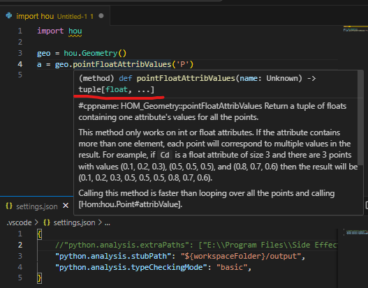
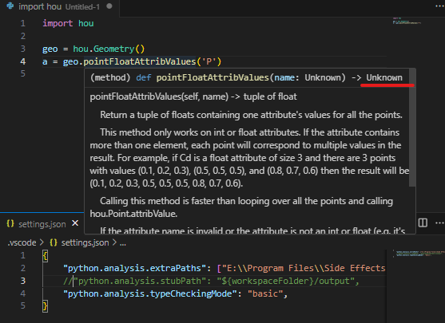
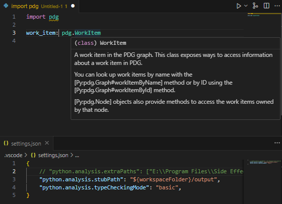
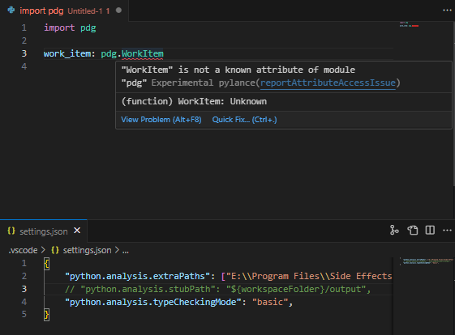

# houdini_help_to_stubs - Parse Houdini help text files to generate pyi files

houdini_help_to_stubs is a tool to parse Houdini help text files to generate pyi files.

## Highlights
- Not only supports `hou` module, but also supports `pdg`!
- Provides richer type information compared to directly setting `python.analysis.extraPaths` in VSCode settings to the Houdini installation directory's `houdini/python3.11libs`.

### Comparison

|  | houdini_help_to_stubs | python.analysis.extraPaths |
| :-: | :-: | :-: |
| hou |  |  |
| pdg |  |  |

## How to

### Generate python stubs

Example:

```bash
python houdini_help_to_stubs.py --houdini-input "C:/Program Files/Side Effects Software/Houdini 20.5.278"
```

### Use python stubs in VSCode

1. Install the Python and Pylance extensions in VSCode.
2. Add the following to your settings.json file:

```json
{
    "python.analysis.stubPath":  "path/to/houdini_help_to_stubs/output",
    "python.analysis.typeCheckingMode": "basic"
}
```

## Note

During the development of this tool, it was observed that the Houdini help information is quite unstructured and inconsistent. This has led to the implementation of numerous workarounds and "dirty" code to ensure compatibility. We hope for improvements in the documentation structure of Houdini in the future.